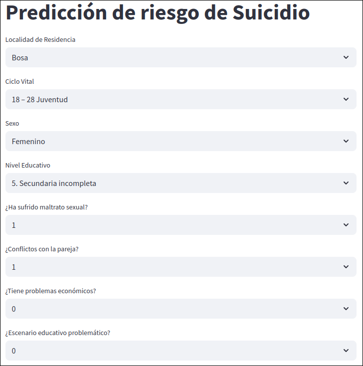
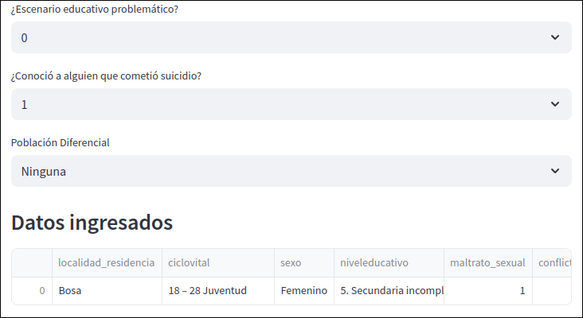
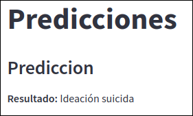

# AnaliticaDatos

## Proyecto de Calidad y Minería de Datos en Python

**Autores:**
- Johnson Chen
- Samuel Arroyave
- Mcklaren Tobar

---

## Resumen del Proyecto

Este proyecto se enfoca en la aplicación de técnicas de calidad y minería de datos a un conjunto de datos relacionados con la Conducta Suicida en Bogotá D.C. El conjunto de datos incluye información sobre el año de notificación, la localidad de residencia, el ciclo vital, la clasificación de la conducta, el sexo, la edad, el nivel educativo, y otros factores relacionados con el riesgo de suicidio. El objetivo es analizar los datos, identificar patrones y construir modelos predictivos utilizando Python.

## Fuentes de Datos

El proyecto utiliza las siguientes fuentes de datos:

*   `Datos/datos.xlsx`: Datos limpios realizados con el documento de 'Calidad_de_datos.ipynb', estos datos fueron utilizados para el análisis.
*   `Datos/osb_conductasuicida_ideacioneintento.csv`: Datos sobre Conducta Suicida en Bogotá D.C. (Fuente: [https://datosabiertos.bogota.gov.co/dataset/tasa-de-suicidio-en-bogota-d-c](https://datosabiertos.bogota.gov.co/dataset/tasa-de-suicidio-en-bogota-d-c))

## Aplicación Streamlit

Se ha desarrollado una aplicación Streamlit para visualizar los datos, explorar diferentes características e interactuar con los modelos. La aplicación proporciona las siguientes funcionalidades:

*   **Despliegue del Modelo:** La aplicación permite la predicción del riesgo de suicidio, con diferentes secciones que el usuario puede elegir.

    

*   **Visualización de apartados:** Muestra los datos ingresados por el usuario.

    

*   **Predicción del modelo:** Muestra la predicción del modelo.

    